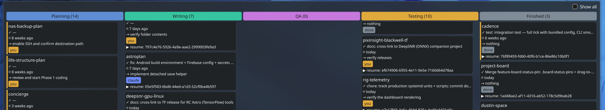

# Project Board

[](https://github.com/dustinspace217/project-board/actions/workflows/ci.yml)

A self-maintaining Kanban board of your [Claude Code](https://claude.ai/code)
projects, rendered as a KDE Plasma 6 desktop widget.

A small Python scanner looks at the projects under your projects root (`~/Claude`
by default) and the Claude Code session transcripts under `~/.claude/projects`,
works out what state each project is in, and writes a single `board.json`. A thin
Plasma plasmoid reads that file and draws a five-column board — Planning, Writing,
QA, Testing, Finished — so you can see every project's status at a glance without
opening anything.

There is no server and no daemon. A `systemd --user` timer re-runs the scan every
15 minutes; the scanner itself runs in 1–2 seconds and exits.

## What it looks like



Each card shows the project name, the last completed work item, how long since it
was last touched, the immediate next step, and an "owner" chip — whose move is next
(`claude`, `you`, or `done`). The name is prefixed with 📌 when you've pinned the card
and ⚠ when its classification is stale (the model was tried but failed). Cards that
have gone quiet past a staleness threshold get an amber edge. Clicking a card copies a `claude --resume <session>` command to
your clipboard so you can jump straight back into that project's conversation.

## How it works

The scanner is pure Python standard library — no third-party packages — so it runs
anywhere Python 3 is installed.

1. **Project detection** (`board/enumerate.py`). Each immediate subdirectory of the
   projects root counts as a project if it has any project marker: a `CLAUDE.md`, a
   `.git/`, a plan document, a root-level `PLAN.md`/`README.md`, a `.board-status`
   pin, or a source/content file. Loose root-level `*.md` plan files (a plan that
   lives as a single file, not yet in its own directory) are surfaced as lightweight
   cards too, so nothing in progress is invisible. A directory can opt out with a
   `.board-ignore` file.

2. **Session attribution** (`board/attribution.py`). Most work happens from the
   projects-root session rather than a per-project one, so a project's own session
   folder is often just tangential command spawns. The scanner instead reads the
   transcripts and attributes each session to the project it mentions most
   (`/<root-name>/<project>` path counts). The result is cached in
   `session_index.json` and rebuilt incrementally — only sessions whose mtime changed
   are re-read — so a scan over hundreds of transcripts stays cheap.

3. **Classification** (`board/llm_classify.py`). For each project, the recent,
   human-readable turns of its session (plus the plan doc's `## Status` block, if
   there is one) are handed to a **local** language model running under
   [Ollama](https://ollama.com) (`qwen2.5:7b`). The model returns the project's
   current bucket, whose move is next, the next step, and any blocker. Everything
   stays on your machine — no transcript text leaves it.

4. **GPU gating** (`board/gpu_gate.py`). Before loading the model, the scanner
   checks the GPU once with `nvidia-smi`. If the GPU is busy (a game, or any heavy
   CUDA workload), it skips all model calls for that scan and carries the previous
   cards forward, so the board never contends with what you're doing. On a machine
   with no NVIDIA GPU this check is a no-op and classification proceeds normally.

5. **Heuristic fallback** (`board/classify.py`). When there is no transcript to read,
   or the model is unavailable, or the GPU is busy, the scanner falls back to a
   deterministic keyword heuristic over the project's `## Status` block. Every card
   records *how* it was classified (`llm`, `carried`, `gated`, `heuristic`, `pinned`)
   so a model outage is visible rather than silent.

`board.json` is written atomically (to a temp file, then renamed) so the widget
never reads a half-written file.

## Features

- **Manual pins.** Drop a `.board-status` file in a project to override what the
  model infers — for example to mark a project finished when the transcript still
  reads as active. A pinned project skips classification entirely; delete the file
  to return to automatic state.
- **Drag to reclassify.** Drag a card to another column in the widget to pin its
  bucket. The widget writes the project's `.board-status` for you, so the change
  survives the next scan.
- **Broader project detection.** Beyond git repos and `CLAUDE.md`, the scanner now
  picks up plan-only projects, source-only directories, and loose root-level plan
  files (see "How it works" above).
- **"Show all" toggle.** Finished projects drop off the board after a few days to
  keep it focused on active work. They are flagged rather than deleted — a "Show all"
  checkbox in the widget reveals the dropped (finished) cards.

## Requirements

- Python 3 (the scanner targets 3.12).
- [Ollama](https://ollama.com) with the `qwen2.5:7b` model pulled
  (`ollama pull qwen2.5:7b`) for live classification. Without it, the scanner still
  runs and falls back to the heuristic.
- An NVIDIA GPU is **optional** — it is only used by the GPU-busy gate. Without one,
  classification simply always proceeds.
- KDE Plasma 6 to display the widget. The scanner alone (writing `board.json`) needs
  none of KDE.

## Install and run

Run a scan by hand at any time:

```sh
python3 scan.py
```

This writes `~/.local/share/project-board/board.json`.

To set it up to refresh automatically and install the widget:

```sh
scripts/install.sh
```

That installs and enables the `systemd --user` timer (every 15 minutes), seeds
`board.json` once so the widget has data immediately, and installs the Plasma
plasmoid. Afterwards, add the widget from your desktop's "Add Widgets" panel
(search for "Project Board").

If you edit the widget's QML, reload it with:

```sh
scripts/reload-widget.sh
```

This upgrades the package, clears the QML cache, and restarts `plasmashell` (your
desktop will flicker for a couple of seconds — that is expected). The board's *data*
auto-refreshes on its own; only *code* changes to the widget need this.

> The widget reads `board.json` from a fixed absolute path. QML cannot expand `~` or
> `$HOME`, so open `plasmoid/org.projectboard/contents/ui/main.qml` and set
> `boardPath` to your own home directory before installing.

## Configuration

- `PROJECT_BOARD_ROOT` — the directory whose subdirectories are scanned as projects.
  Defaults to `~/Claude`. Set it to point the board at a different layout:

  ```sh
  PROJECT_BOARD_ROOT="$HOME/code" python3 scan.py
  ```

## Tests

The test suite is hermetic — it uses synthetic fixtures and never touches your real
`~/.claude` or the GPU, and runs with classification disabled (`allow_llm=False`),
so no Ollama or NVIDIA hardware is needed:

```sh
python3 -m pytest -q
```
